# Tugas pertemuan ke 2
Repository ini digunakan untuk memenuhi Tugas Lab2Web

Nama    : Dani Darmawan 
NIM     : 312010154 
KELAS   : TI.20.B1  
## 1. Membuat Dokumen HTML
**Input** 
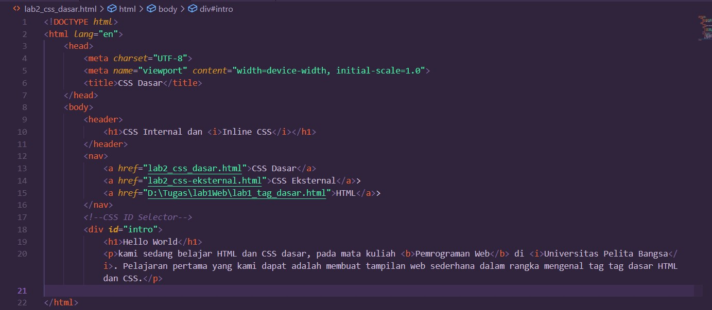 
**Output** 
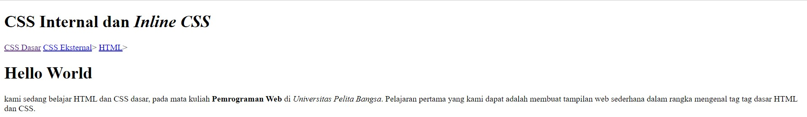 
## 2. Mendeklarasikan Internal CSS
**Input** 
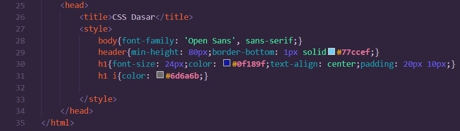 
**Output** 
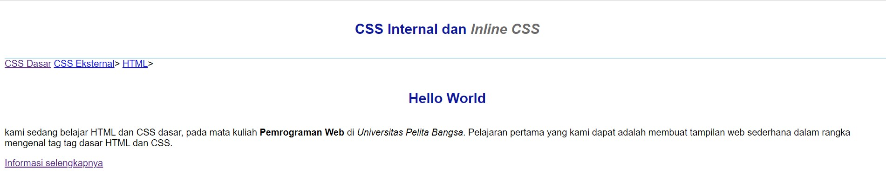 
## 3. Menambahkan Inline CSS
**Input** 
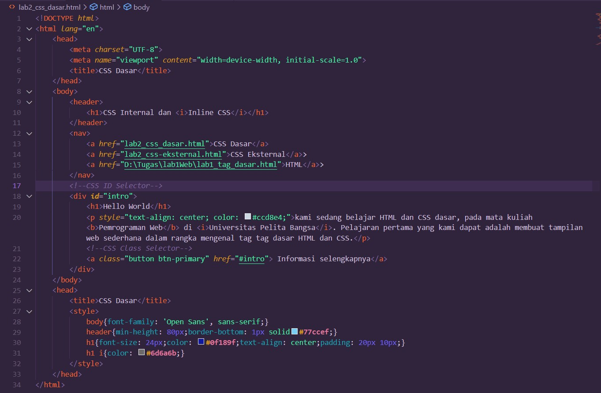 
**Output** 
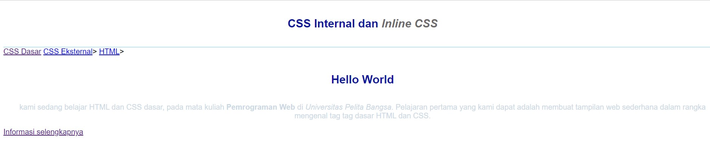 
## 4. Membuat CSS Eksternal
**Input** 
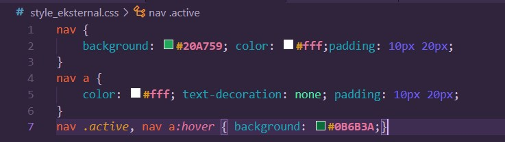 
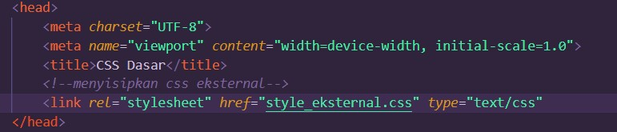 
**Output** 
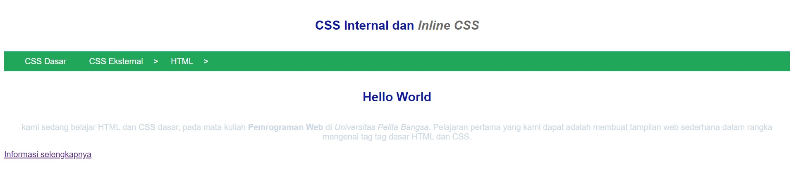 
## 5. Menambahkan CSS Selector
**Input** 
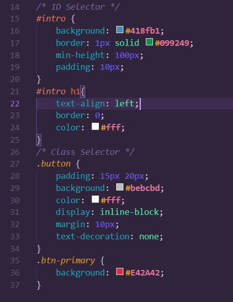 
**Output** 
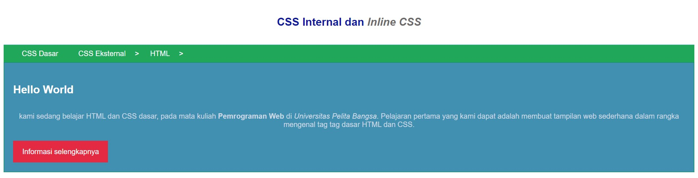 