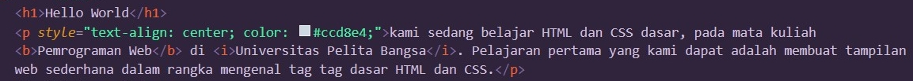

# Tugas pertemuan ke 2
Repository ini digunakan untuk memenuhi Tugas Lab2Web

Nama    : Dani Darmawan<br>
NIM     : 312010154<br>
KELAS   : TI.20.B1 <br>
## 1. Membuat Dokumen HTML
### Input
<br>
### Output
<br>
### Penjelasan
Dalam Pembuatan Doc HTML penjelasannya tidak berbeda jauh dengan [Lab1Web](https://github.com/dandrwn/Lab1Web)
## 2. Mendeklarasikan Internal CSS
### Input
<br>
### Output
<br>
### Penjelasan
```body{font-family: 'Open Sans', sans-serif;} ``` <br>
fungsi perintah diatas adalah merubah format teks yang ada pada web<br>
```header{min-height: 80px;border-bottom: 1px solid#77ccef;}```
fungsi perintah diatas menambahkan border pada header teks <br>
min-height: 80px berfungsi sebagai jarak antar header<br>
border-bottom: 1px solid#77ccef berfungsi sebagai ketebalan dan warna border<br>
## 3. Menambahkan Inline CSS
### Input
**Sesudah Menambahkan Inline CSS**<br>
<br>
**Sebelum ditambahkan Inline CSS**<br>
<br>
### Output
<br>
### Penjelasan
Penambahan Inline CSS ```style="text-align: center; color: #ccd8e4;"``` ini merubah posisi dan warna teks, <br>
yang dimana ```style="text-align: center;``` merubah posisi paragraf ke tengah <br>
```color: #ccd8e4;``` merubah warna teks yang ada pada paragraf tersebut.<br>
## 4. Membuat CSS Eksternal
### Input
<br>
### Penjelasan
Penambahan Warna Background dan penambahan warna teks
<br>
### Penjelasan
```<link rel="stylesheet" href="style_eksternal.css" type="text/css"```<br>
Memasukan CSS eksternal
### Output
<br>

## 5. Menambahkan CSS Selector
### Input
<br>
### Output
<br>

# Jawab Pertanyaan
1. Lakukan eksperimen dengan mengubah dan menambah properti dan nilai pada kode CSS 
dengan mengacu pada CSS Cheat Sheet yang diberikan pada file terpisah dari modul ini.<br>
**Hasil Eksperimen**
<br>
link di bawah adalah eksperiment yang telah saya lakukan<br>
[CSS_Eksperimen](style_eksternal.css)
2. Apa perbedaan pendeklarasian CSS elemen ```h1 {...}``` dengan ```#intro h1 {...}```? berikan 
penjelasannya!<br>
```h1 {...}``` style Heading biasa <br>
```#intro h1 {...}``` Penambahan style pada h1 di dalam element id intro<br> 
3. Apabila ada deklarasi CSS secara internal, lalu ditambahkan CSS eksternal dan inline CSS pada 
elemen yang sama. Deklarasi manakah yang akan ditampilkan pada browser? **yang terakhir di load**<br> Berikan 
penjelasan dan contohnya!<br>
<br>
<br>
<br>
<br>


4. Pada sebuah elemen HTML terdapat ID dan Class, apabila masing-masing selector tersebut 
terdapat deklarasi CSS, maka deklarasi manakah yang akan ditampilkan pada browser?<br>
Berikan penjelasan dan contohnya! ( ```<p id="paragraf-1" class="text-paragraf">``` )<br>
<br>
<br>
<br>
